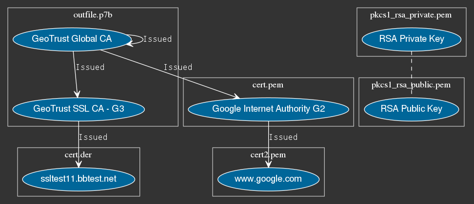

keyview
-------

`keyview` is a tool that displays information about a variety of certificate and
key formats graphically and textually. These formats include:

- DER/PEM encoded PKCS#1/PKCS#8 private/public keys
- DER/PEM encoded X509 certificates
- DER/PEM encoded PKCS7 bundles
- PKCS#12 bundles
- Concatenated PEM files

Note that the terminology above is somewhat loose. This is due to various tools
producing strange certificate representations. `keyview` handles these as best
it can.

The main benifit of keyview, however, is that you don't need to know anything about
key/certificate forms. Just throw some files at `keyview` and let it do the work.

Installation
------------

Just install with `python setup.py`, and you will be able to run `keyview` from the
command line. `keyview` requires python 3+.

Usage
-----

`keyview` has two main usages. Textual output that attempts to duplicate what you
would see from `openssl`, and a graphical view. The text output can be used like:

    keyview info <cert1> <cert2>...

And it will generate output like:

    X509 Certificate:
    Data:
        Version: 3 (0x2)
        Serial Number:
            02:34:56
    Signature Algorithm: sha1WithRSAEncryption
        Issuer: countryName=US, organizationName=GeoTrust Inc., commonName=GeoTrust Global CA
        Validity:
            Not Before: May 21 04:00:00 2002 GMT
            Not After : May 21 04:00:00 2022 GMT
        Subject: countryName=US, organizationName=GeoTrust Inc., commonName=GeoTrust Global CA
    ....

You can generate graphical output with the `graph` command:

    keyview graph <cert1> <cert2>...

Which will produce output like:

